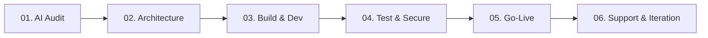

# GoRan AI Agency — Business Research & Overview

A comprehensive research profile of **GoRan AI Agency**, compiled from the live site [goran.in](https://goran.in).

---

## 🏢 Business Identity & Core Conviction

**GoRan AI Agency** is a premium systems-engineering and custom AI development agency specializing in **Autonomous AI Agents**, **Enterprise Automations**, and **High-Fidelity Interfaces**. 

* **Core Conviction:** Human minds are too valuable to be wasted on repetitive chores (copy-pasting data, updating spreadsheets, routing emails manually). AI agents should execute the repetitive **80%** of operational work so human teams can focus on the strategic **20%**.
* **Target Audience:** Startups to global enterprises looking to eliminate operational friction and scale their business on autopilot.

---

## 👤 Leadership

* **Founder & AI Systems Architect:** **Ashish Ranjan**
* **Background:** 
  * Started writing scripts in **2020** in Python to help local businesses automate spreadsheet tasks.
  * Mastered high-scale Web2 and Web3 backend infrastructure, database synchronization pipelines, and low-latency integrations.
  * Personally reviews every new project to ensure standard, production-ready system architecture.
  * Obsessed with **operational leverage, system speed, and building things that last**.

---

## 🛠️ Service Offerings

GoRan AI delivers business automation from strategy to continuous support through a linear 6-step lifecycle:

### 1. AI Audit & Strategy (2-3 Weeks)
* **Goal:** Identify exactly where AI can cut costs and increase leverage.
* **Deliverables:** Full tech stack assessment, ROI Opportunity scoring matrix, and an 8-week implementation roadmap.
* **Tools:** Notion, Figma, Miro, Airtable, Slack.

### 2. Product Development
* **Goal:** Designing and building custom AI-powered applications, specialized LLM tools, and polished frontends from first principles (no templates).
* **Delivery:** Full development sprints with weekly interactive demos.

### 3. Dedicated AI Product Management
* **Goal:** Embedding an experienced AI product manager to own features, manage engineering sprints, and ensure delivery ties directly to business outcomes.

### 4. AI Training & Enablement
* **Goal:** Upskilling internal staff through hands-on workshops, prompt engineering, and tool building.

---

## 🧠 The Intelligence Layer (Core Products)

GoRan AI designs, deploys, and orchestrates highly autonomous digital agents:

| Agent / Product | Capabilities | Setup Time | Core Tech Stack |
| :--- | :--- | :--- | :--- |
| **Voice AI Agent** | Natural-sounding inbound/outbound calls, lead qualification, and appointment scheduling at `<800ms` latency. | 3–5 Weeks | LiveKit, Gemini Realtime API, Twilio, WebRTC |
| **WhatsApp & Telegram Agent** | Capturing leads, displaying catalogs, processing orders, and answering customer queries 24/7. | 2–4 Weeks | WhatsApp Cloud API, Telegram Bot API, Python |
| **AI-Powered CRM** | Automated lead scraping, pipeline enrichment, intent scoring, and custom personalized outreach. | 4–6 Weeks | Puppeteer, LangChain, PostgreSQL |

---

## 📊 Proven Case Studies (Production Deployments)

GoRan AI has successfully delivered real margins and high-ROI systems:

### 🚀 01. AI Sales Automation (Maruti Techno Rubber)
* **Problem:** Fragmented sales leads across WhatsApp, website, and distributors causing massive response delays (9-hour average).
* **Solution:** An automated AI CRM that instantly categorizes, scores, and routes leads.
* **Result:** **Lead conversion boosted by 73%**; response time dropped to **under 3 minutes**.
* **Tech:** React, Node.js, MongoDB, OpenAI API.

### 🌾 02. AI Agriculture Platform (Anaaj AI)
* **Problem:** 12,000+ rural Indian farmers struggling to get immediate crop advice, disease diagnostics, and mandi pricing.
* **Solution:** Multilingual mobile agricultural assistant powered by AI.
* **Result:** **12,000+ farmer queries automated** with image-based disease analysis on autopilot.
* **Tech:** React Native, Firebase, Gemini API, Node.js.

### 📞 03. AI Voice Automation (NexaCall Solutions)
* **Problem:** Inbound support queues overwhelmed by repetitive appointment bookings and basic troubleshooting queries.
* **Solution:** Low-latency calling agents utilizing state-of-the-art voice APIs.
* **Result:** **84% of inbound support calls fully automated**.
* **Tech:** LiveKit, Gemini Realtime API, Node.js, WebRTC.

### 🎓 04. AI Lead Management (EduConsult Global)
* **Problem:** Delayed follow-ups and poor student-counselor matching with high inquiry volumes.
* **Solution:** Pre-scoring lead nurturing CRM operating automatically across Email and WhatsApp.
* **Result:** **3.2x increase in consultation bookings**.
* **Tech:** Next.js, FastAPI, PostgreSQL, OpenAI API.

---

## 🎨 Immersive Interface Layer

In addition to intelligent backends, GoRan AI builds premium frontends showcasing advanced CSS and micro-interactions:
* **Art Nexus Delta:** Generative horizontal scrolling grid catalog.
* **Aura Grid Layout:** Glassmorphic modern landing page built with Vanilla CSS.
* **Raw Pressery Clone:** High-fidelity e-commerce clone featuring complex slide transitions.
* **ASME Chapter Hub & RoboWeek 3.0:** Mechanical and robotics symposium portals with interactive cybernetic visuals.

---

## 📈 Global Benchmark Metrics

* **System Uptime:** `99.9%` (Guaranteed & Operational)
* **Daily Executions:** `500k+` autonomous agent actions daily.
* **Client Trust Score:** `4.9/5` rating across deployments.
* **Average Response Time:** `<5 hours` (Target: under 24 hours).

---

## 📞 Get In Touch
* **Email:** `goran.dotin@gmail.com`
* **WhatsApp:** `+91 99342 25353`
* **Socials:** [LinkedIn](https://www.linkedin.com/company/107898890) | [X (Twitter)](https://x.com/goranai) | [Instagram](https://www.instagram.com/goran.dotin/) | [Facebook](https://facebook.com/goranai) | [YouTube](https://youtube.com/@goranai)
