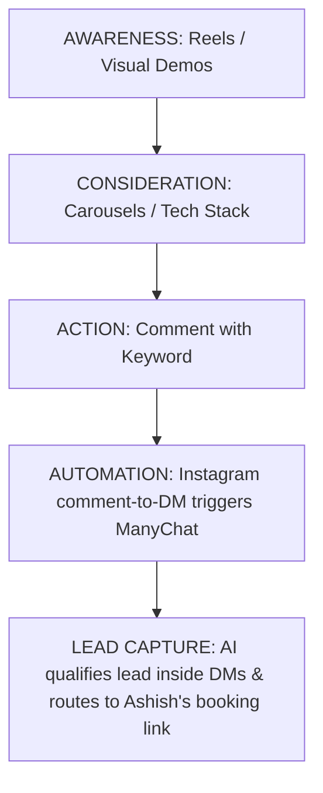

# GoRan AI Agency — Instagram Growth & Posting Strategy

An actionable, B2B-focused Instagram growth playbook specifically tailored for **GoRan AI Agency** ([goran.in](https://goran.in)).

---

## 🎯 B2B Growth Strategy Overview
B2B decision-makers on Instagram (founders, agency owners, ops directors, clinic owners) do not care about generic AI hype or abstract prompts. They care about **leverage, margin, and execution reliability**. 

To grow `@goran.dotin`, your content must pivot around:
1. **Show, Don't Tell:** Proof-of-concept videos displaying actual low-latency voice callers and system integrations in action.
2. **Zero-Hype Case Studies:** Using real client metrics (Maruti Techno Rubber, Anaaj AI, NexaCall) to build trust.
3. **Intent-Driven DM Automation:** Turning views into qualified leads by prompting comments that trigger custom workflows.

---

## 📈 Content Pillars & Funnel

*   **Awareness (Reels):** Explaining high-level problems, illustrating voice AI latency, behind-the-scenes engineering.
*   **Consideration (Carousels):** 6-step roadmap breakdown, deep-dive architecture specs, why traditional systems fail.
*   **Conversion (DMs):** Automatic triggers that qualify inquiries and schedule scoping calls.

---

## 🎥 5 High-Converting Instagram Post Templates

### 01. Reel: The "LiveKit Voice Agent in Action" Demo
*   **Visual:** Split-screen or screen-recording. Ashish is talking on his phone to a custom NexaCall voice agent. Subtle overlays show a millisecond timer demonstrating **under 800ms latency**.
*   **Hook (First 3s):** 
    > *"I built a custom AI calling agent that books meetings and handles objections better than a human. Watch this."*
*   **Script / Voiceover:**
    *   *Show Ashish making a real call.*
    *   *Ashish:* "Hey, I'm busy. Why should I use your service?"
    *   *AI Agent (extremely natural tone & lag-free):* "I completely get that, Ashish! In just 15 seconds, we automate your spreadsheet entries so you can save 4 hours a day. Should I book a quick call for you tomorrow at 10 AM?"
    *   *Ashish speaks to camera:* "This isn't a mock-up. It's built on LiveKit, the Gemini Realtime API, and custom Twilio routing. It handles support, qualifies leads, and schedules meetings 24/7."
*   **Call-to-Action (CTA):** 
    *   *"Comment **'CALL'** and my AI will automatically send you the exact Github repository template and LiveKit setup guide."*

---

### 02. Carousel: The "Maruti Techno Rubber Case Study" (Zero Hype)
*   **Slide 1 (Main Image):** Bold typography on dark glassmorphic background: *"How we cut industrial lead response times from 9 hours to 180 seconds."*
*   **Slide 2 (The Friction):** Describe Maruti's problem. Fragmented leads coming from website, email, WhatsApp, and distributors. Sales staff overwhelmed, resulting in lost deals.
*   **Slide 3 (The Architecture):** Simple, premium diagram showing the GoRan AI solution: Puppeteer scraper → OpenAI scoring agent → custom WhatsApp push API.
*   **Slide 4 (The Margins):** Bold stats: **73% boost in lead conversion** and average response time dropped below 3 minutes.
*   **Slide 5 (The Takeaway):** In B2B, **speed is the ultimate competitive advantage**. If you respond first, you secure the deal.
*   **CTA (Slide 6):** 
    *   *"Want to automate your CRM routing? Comment **'SPEED'** and I'll DM you our 1-page Maruti routing architecture checklist."*

---

### 03. Reel / Carousel: "Build in Public: My Favorite AI Tech Stack for 2026"
*   **Visual:** Ashish sitting at his desk, walking through a beautiful, clean architecture board in Figma, or a physical whiteboard.
*   **Hook (First 3s):** 
    > *"This is the exact production tech stack I use to orchestrate 500,000+ AI agent actions daily without crashes."*
*   **Script / Slide Content:**
    *   **Orchestration:** *"Forget simple wrappers. We use LangGraph and CrewAI for complex state management and multi-agent loops."*
    *   **Database:** *"PostgreSQL for relational integrity; Redis for rapid session caching."*
    *   **AI Engine:** *"Gemini and OpenAI APIs operating behind a custom proxy to handle rate-limits and failovers gracefully."*
    *   **Deployment:** *"Dockerized microservices running on secure cloud infrastructure with custom CI/CD pipelines."*
*   **CTA:** 
    *   *"We spent months testing this architecture. Comment **'STACK'** and I will send you the diagram and tool list directly to your inbox."*

---

### 04. Reel: "Why Traditional Chatbots Are Dead (And What to Build Instead)"
*   **Visual:** Ashish talking passionately to the camera with dynamic, bold kinetic typography appearing on screen.
*   **Hook (First 3s):** 
    > *"Stop building static chatbots. They are actually costing you customers."*
*   **Script / Voiceover:**
    *   *"Traditional chatbots are basically clunky, hardcoded decision trees. If a user types something outside the script, it breaks down."*
    *   *"In 2026, you need autonomous **AI Agents**."*
    *   *"Unlike bots, agents perceive their environment. They can query your inventory database, update your Hubspot CRM, trigger an invoice on Stripe, and send follow-up emails on complete autopilot."*
    *   *"They don't just chat. They execute operations."*
*   **CTA:** 
    *   *"Comment **'AGENT'** and my AI will automatically audit your site and DM you 3 custom autonomous workflows you should deploy today."*

---

### 05. Reel: "The Multilingual Farmer AI Advisor (Anaaj AI)"
*   **Visual:** B-roll of rural India or agricultural landscapes, shifting quickly to a premium mobile app UI (multilingual screen, crop photo upload).
*   **Hook (First 3s):** 
    > *"We built an AI advisor that helps 12,000+ farmers across rural India diagnose crop diseases instantly."*
*   **Script / Voiceover:**
    *   *"Most farmers had to wait days to get crop recommendations or consult expensive experts."*
    *   *"We built **Anaaj AI**, a zero-friction multilingual mobile assistant."*
    *   *"Farmers simply take a picture of a diseased leaf. The agent processes the image, diagnoses the disease, tracks local mandi pricing, and reads crop suggestions out loud in their local language."*
    *   *"B2B AI isn't just for tech startups — it's built to drive real-world impact where it matters."*
*   **CTA:** 
    *   *"Comment **'FARM'** and I'll send you the detailed UI walkthrough and product development case study."*

---

## 🛠️ DM Lead-Gen Setup & Growth Tactics

To make these post ideas work on autopilot, implement this automated qualifying funnel:

1. **ManyChat / Instagram DM Automation Integration:**
   * Configure keywords (`CALL`, `SPEED`, `STACK`, `AGENT`, `FARM`).
   * When a user comments, send the promised value asset (guide, repository, checklist) immediately.
2. **The "Pre-Scoring" Conversational AI:**
   * Inside the DM conversation, have your chatbot ask 2 simple qualifying questions:
     1. *"Awesome! What business do you run?"*
     2. *"What's your biggest operational bottleneck right now?"*
3. **Routing & Booking:**
   * If they are a qualified lead (e.g., agency owner, ecommerce founder, clinic director), trigger the Calendly/scoping call link.
   * If not, provide the download resource politely and keep them nurtured.
